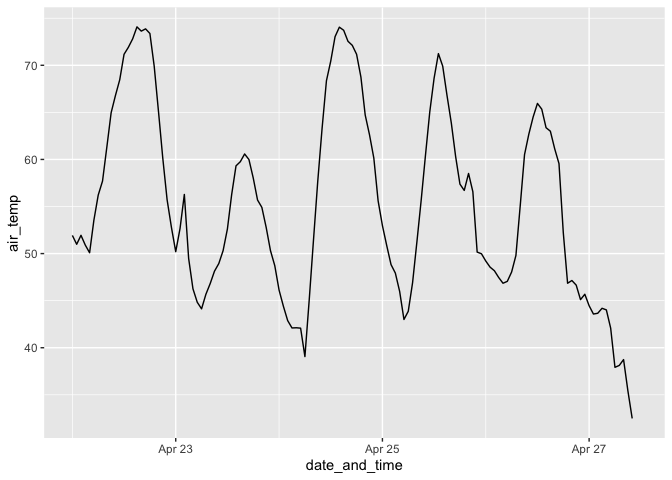

<!-- README.md is generated from README.Rmd. Please edit that file -->

# rcoagmet

<!-- badges: start -->

[](https://github.com/andypicke/rcoagmet/actions/workflows/R-CMD-check.yaml)
<!-- badges: end -->

The goal of rcoagmet is to provide functions for downloading data from
[CoAgMet](https://coagmet.colostate.edu/) weather stations, using their
[Data API](https://coagmet.colostate.edu/data/doc.html).

## Installation

You can install the development version of rcoagmet from
[GitHub](https://github.com/) with:

``` r
# install.packages("devtools")
devtools::install_github("andypicke/rcoagmet")
```

## Example

Download metadata for all CoAgMet stations:

``` r
library(rcoagmet)

meta <- get_coagmet_meta()

head(meta)
#> NULL
```

Download data for one station:

``` r

df <- get_coagmet_data_one_station("cht01")
#> Rows: 133 Columns: 14
#> ── Column specification ────────────────────────────────────────────────────────
#> Delimiter: ","
#> chr (14): Station, Date and Time, Air Temp, RH, Dewpoint, Solar Rad, Precip,...
#> 
#> ℹ Use `spec()` to retrieve the full column specification for this data.
#> ℹ Specify the column types or set `show_col_types = FALSE` to quiet this message.
#> Warning: 1 failed to parse.

head(df)
#> # A tibble: 6 × 16
#>   station date_and_time       air_temp    rh dewpoint solar_rad precip  wind
#>   <chr>   <dttm>                 <dbl> <dbl>    <dbl>     <dbl>  <dbl> <dbl>
#> 1 cht01   2024-04-22 00:00:00     51.9 0.537     35.7         0      0 11.6 
#> 2 cht01   2024-04-22 01:00:00     51.0 0.526     34.3         0      0  8.81
#> 3 cht01   2024-04-22 02:00:00     51.9 0.451     31.3         0      0  6.88
#> 4 cht01   2024-04-22 03:00:00     50.9 0.438     29.6         0      0  3.99
#> 5 cht01   2024-04-22 04:00:00     50.1 0.433     28.6        NA      0  4.7 
#> 6 cht01   2024-04-22 05:00:00     53.6 0.361     27.3         0      0  7.11
#> # ℹ 8 more variables: wind_dir <dbl>, gust_speed <dbl>, gust_time <chr>,
#> #   gust_dir <dbl>, x5cm_soil_temp <dbl>, x15cm_soil_temp <dbl>, date <date>,
#> #   gust_time2 <dttm>
```

Plot air temp:

``` r

df |>
  ggplot2::ggplot(ggplot2::aes(date_and_time, air_temp)) +
  ggplot2::geom_line()
#> Warning: Removed 1 row containing missing values or values outside the scale range
#> (`geom_line()`).
```



Make an interactive plot of one variable with plotly:

``` r

#plot_coagmet_plotly(df, "air_temp")
```
