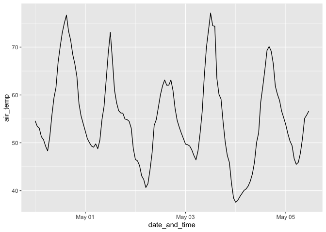

<!-- README.md is generated from README.Rmd. Please edit that file -->

# rcoagmet

<!-- badges: start -->

[](https://github.com/andypicke/rcoagmet/actions/workflows/R-CMD-check.yaml)
[](https://lifecycle.r-lib.org/articles/stages.html#experimental)
<!-- badges: end -->

The goal of rcoagmet is to provide functions for downloading data from
[CoAgMet](https://coagmet.colostate.edu/) weather stations, using their
[Data API](https://coagmet.colostate.edu/data/doc.html).

## Installation

You can install the development version of rcoagmet from
[GitHub](https://github.com/) with:

``` r
# install.packages("devtools")
devtools::install_github("andypicke/rcoagmet")
```

## Example

Download metadata for all CoAgMet stations:

``` r
library(rcoagmet)

meta <- get_coagmet_meta()

head(meta)
#> # A tibble: 6 × 13
#>   station name        location       latitude_deg_n longitude_deg_e elevation_ft
#>   <chr>   <chr>       <chr>                   <dbl>           <dbl>        <dbl>
#> 1 akr02   Akron       USDA-ARS-GPRC            40.2           -103.         4537
#> 2 alt01   Ault        1 mi SE Ault             40.6           -105.         4910
#> 3 avn01   Avondale    1 mi SE Avond…           38.2           -104.         4630
#> 4 bla01   Blanca      8 mi SW Blanca           37.4           -106.         7755
#> 5 bnv01   Buena Vista CDW Area SW o…           38.8           -106.         7900
#> 6 brg01   Briggsdale  3 mi S Briggs…           40.6           -104.         4858
#> # ℹ 7 more variables: anemometer_height_m <dbl>, active <chr>,
#> #   irrigation <chr>, first_observation <chr>, last_observation <chr>,
#> #   timestep_s <dbl>, network <chr>
```

Find closest CoAgMet station to a given point:

``` r

# coordinates for Denver
xlat <- 39.74
xlon <- -104.99

nearest_station <- find_closest_coagmet_station(xlat, xlon)
#> New names:
#> • `` -> `...1`
#> • `` -> `...2`

nearest_station
#> # A tibble: 1 × 14
#>   station name   location            latitude_deg_n longitude_deg_e elevation_ft
#>   <chr>   <chr>  <chr>                        <dbl>           <dbl>        <dbl>
#> 1 den01   Denver CSU Spur campus, H…           39.8            -105         5280
#> # ℹ 8 more variables: anemometer_height_m <dbl>, active <chr>,
#> #   irrigation <chr>, first_observation <chr>, last_observation <chr>,
#> #   timestep_s <dbl>, network <chr>, distance_m <dbl>
```

Download data for one station:

``` r

df <- get_coagmet_data(station_id = "den01")

head(df)
#> # A tibble: 6 × 14
#>   station date_and_time       air_temp    rh dewpoint solar_rad precip  wind
#>   <chr>   <dttm>                 <dbl> <dbl>    <dbl>     <dbl>  <dbl> <dbl>
#> 1 den01   2024-04-30 00:00:00     54.6 0.377     29.3      0         0  2.19
#> 2 den01   2024-04-30 01:00:00     53.5 0.387     28.9      0         0  2.53
#> 3 den01   2024-04-30 02:00:00     53.0 0.39      28.7      0         0  2.3 
#> 4 den01   2024-04-30 03:00:00     51.3 0.432     29.6      0         0  0.96
#> 5 den01   2024-04-30 04:00:00     50.7 0.441     29.6      0         0  1.85
#> 6 den01   2024-04-30 05:00:00     49.3 0.493     31.1      0.57      0  4.1 
#> # ℹ 6 more variables: wind_dir <dbl>, gust_speed <dbl>, gust_dir <dbl>,
#> #   x5cm_soil_temp <dbl>, x15cm_soil_temp <dbl>, date <date>
```

Plot air temp:

``` r

df |>
  ggplot2::ggplot(ggplot2::aes(date_and_time, air_temp)) +
  ggplot2::geom_line()
```



Make an interactive plot of one variable with plotly:

``` r

#plot_coagmet_plotly(df, "air_temp")
```
